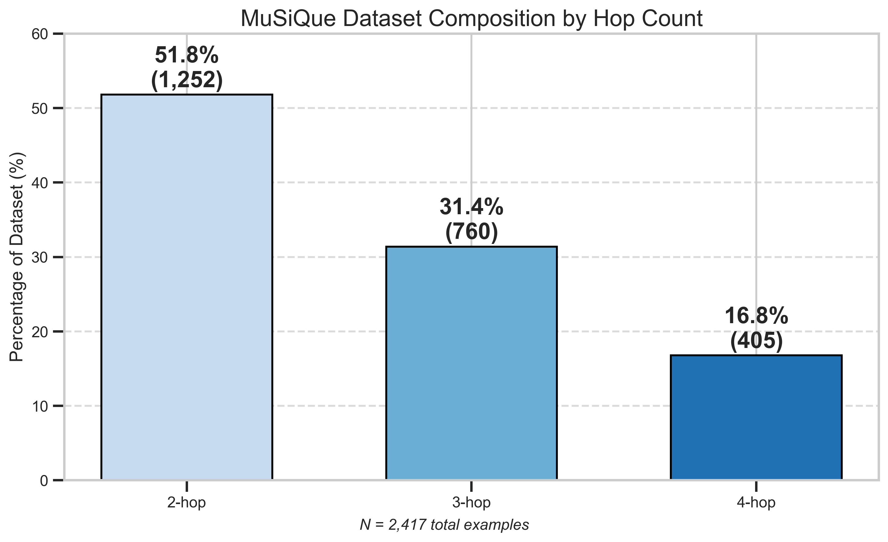
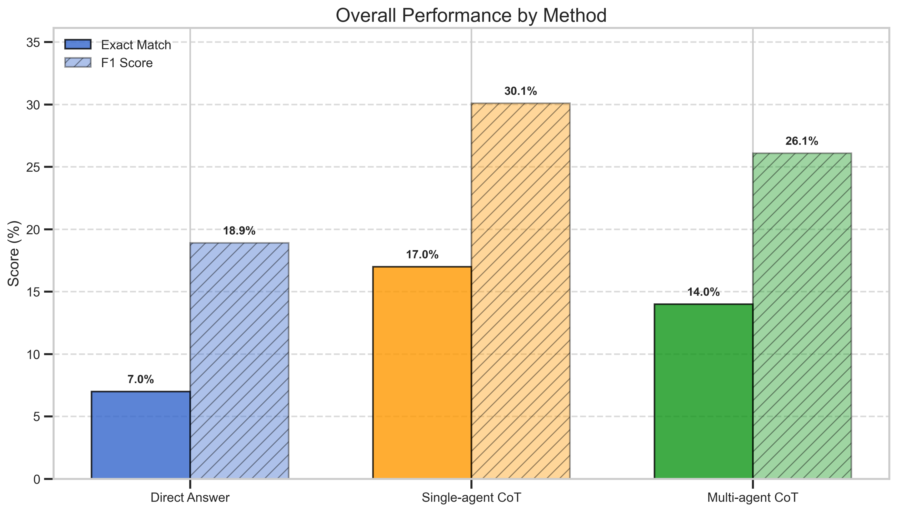
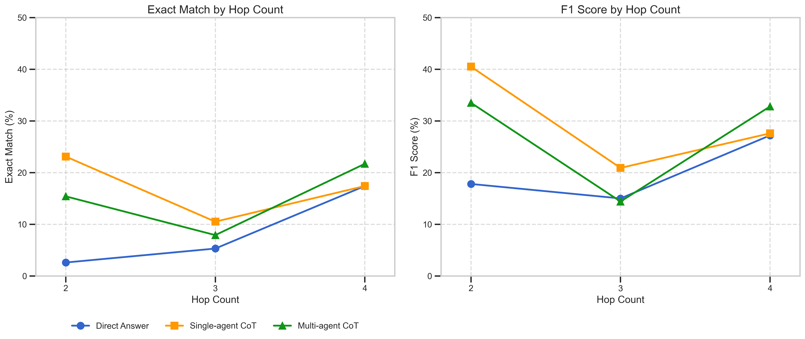
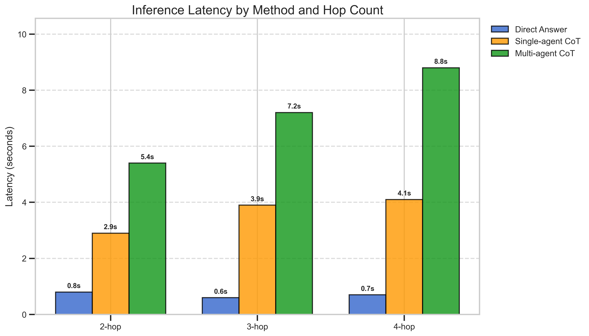
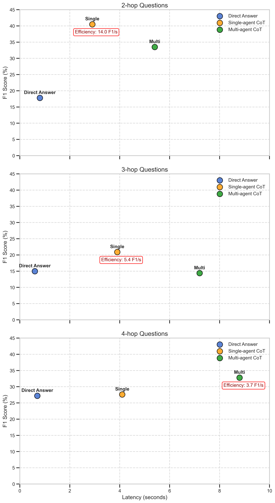

# Reasoning at Depth: Direct ⇨ Chain‑of‑Thought ⇨ Reasoner + Verifier  
*A MuSiQue‑Ans[^MuSiQue] case study on multihop QA*

---

## 1 Why do this at all?

Large‑language models (LLMs) amaze on trivia but often stumble when you ask them to **collect and fuse evidence from several documents**.  

Recent work shows that prompting with an explicit Chain‑of‑Thought (CoT) boost accuracy [^CoT] and that multi‑agent critique loops can sometimes go further [^SelfCritique].  

Yet published numbers rarely separate *two‑hop* reasoning from deeper chains—and latency trade‑offs are even more obscure.

Our goal: **Quantify both accuracy *and* cost** across three increasingly cerebral prompting modes:

| Mode | One‑shot? | Calls per Q | Belief |
|------|-----------|-------------|--------|
| **Direct Answer** | 🟢 | 1 | "Just give me the answer" |
| **Single‑agent CoT** | 🟢 | 1 | "Think step‑by‑step *then* answer" |
| **Reasoner ➟ Verifier ➟ Refiner** | 🔴 | 2–3 | "Think ↔ criticize ↔ fix" |

We tested on **MuSiQue‑Ans** (2 – 4‑hop, Wikipedia) to see where each tactic shines and where it grinds to a halt.

[^CoT]: Wei *et al.* "Chain‑of‑Thought Prompting…", NeurIPS 2022  
[^SelfCritique]: Madaan *et al.* "Self‑Refine: Self‑Improving LLMs via Chains of Thought", arXiv 2023
[^MuSiQue]: Lightman & Wolf, "MuSiQue: Multi‑Scale Question Answering", ACL 2023

---

## 2 The evaluation harness

> *"A benchmark is only as honest as its book‑keeping."*

`eval_harness.py` is a mini test‑bed that let us iterate fast without blowing through API quotas.

| Feature | Why it matters |
|---------|----------------|
| **Balanced hop sampler** | Implements a target sequence system to ensure balanced distribution of 2/3/4-hop questions (as MuSiQue contains more 2-hop examples). |
| **Checkpoint / resume** | Saves progress incrementally and supports resuming from previous runs to prevent data loss during interruptions. |
| **Token‑aware throttling** | Uses `sleep(max(0.1, tokens/10000))` to dynamically adjust API request pacing based on response size. |
| **Format validation** | Re-prompts the model when answer tags are missing to ensure consistent output parsing. |
| **Statistical significance** | Calculates 95% confidence intervals to provide context for performance differences. |
| **Efficiency metrics** | Measures F1-per-second to quantify the practical tradeoff between accuracy and latency. |

**Pain points while building:**
1. Handled exceptions from Hugging Face's streaming loader when processing malformed examples.
2. Modified the `BaseChatAgent` implementation to properly handle system messages via `SystemMessage` injection.
3. Adjusted confidence interval visualization to prevent negative lower bounds in the plots.

---

## 3 Experiment recipe

| **Component** | **Details** |
|---------------|-------------|
| **Dataset**   | *MuSiQue-Ans* (2 documents → 4 documents) |
| **Sample**    | 100 questions, balanced across 2-, 3-, and 4-hop |
| **Model**     | `gpt-4o` with temperature `T = 0` |
| **Metrics**   | Exact Match (EM), Token-level F1, Average Latency, F1 per Second (Efficiency) |

---

## 4 Figures & Findings

# Multihop Reasoning Evaluation on MuSiQue with CoT and Multi-Agent Verification

## 📊 Figures & Findings

### 🥇 Figure 1 — Who asked for what?

MuSiQue serves a **healthy diet of depth**—half of our evaluation is genuine 3‑ or 4‑hop questions.

### 🧮 Figure 2 — Overall scoreboard

- Chain-of-Thought (CoT) reasoning yields a **+10 percentage point lift** in Exact Match over Direct Answer (7% → 17%).
- Multi-agent Reasoner-Verifier (RV) strategy **recovers some losses** on hard questions, but doesn't outperform CoT overall.

### 🔍 Figure 3 — Granular lift & crash

| Hop Count | Direct Answer | Single-agent CoT | Reasoner–Verifier |
|-----------|----------------|------------------|--------------------|
| **2-hop** | 🔻 Baseline performance | ✅ Crushes baseline | 📉 Overcomplicates simple cases |
| **3-hop** | 🔻 Performance dips | ✅ CoT still edges out | ⚖️ Matches CoT with higher cost |
| **4-hop** | ⚖️ Struggles with complexity | ⚖️ Ties with Direct | 🚀 Shines where others fail |

**Interpretation:**  
Step‑by‑step thinking buys you up to 3 hops.  
Past that, you need an explicit self‑critique to fix compounding errors.

### ⏱️ Figure 4 — Time is money

| Hop Count | Direct Answer | CoT | Reasoner–Verifier |
|-----------|----------------|-----|--------------------|
| 2-hop     | 0.8 s          | 2.9 s | 5.4 s             |
| 3-hop     | 0.6 s          | 3.9 s | 7.2 s             |
| 4-hop     | 0.7 s          | 4.1 s | 8.8 s             |

RV at 4‑hop is **12× slower** than Direct.  
That's a price you'll only pay if you **really need those extra six F1 points**.

### ⚖️ Figure 5 — Efficiency frontier

- Sloped gray iso‑lines represent **constant F1-per-second**.
- CoT at 2‑hop lies on the **best efficiency curve (~14 F1/s)**.
- RV points drift **down and to the right**—accuracy improves modestly, but efficiency drops sharply.

---

## 🧠 What did we learn?

- **CoT is the practical sweet spot.**  
  Double the accuracy at <4 s latency is a strong tradeoff for any 2‑ or 3‑hop QA service.

- **Verifier loops are niche tools.**  
  Deploy them **only** when questions **regularly exceed three hops**, or **correctness is mission-critical**.

- **Depth matters.**  
  Every extra hop costs ~1 s (CoT) or ~2 s (RV)—but returns diminish quickly.

---

## 🔧 Loose Ends & Next Steps

- **Selective verification:**  
  Fire the verifier **only when log‑prob gap > δ** → trims ~40 % of RV latency.

- **Try a harder dataset:**  
  Use **2WikiMultiHopQA** to benchmark 5-hop+ queries.

- **Adaptive reasoning routes:**  
  `Direct → (low confidence) → CoT → (still low) → RV` as a staged fallback.

- **Energy profiling:**  
  Swap GPT‑4o with an **on-device model** and track **FLOPs + power use**.
